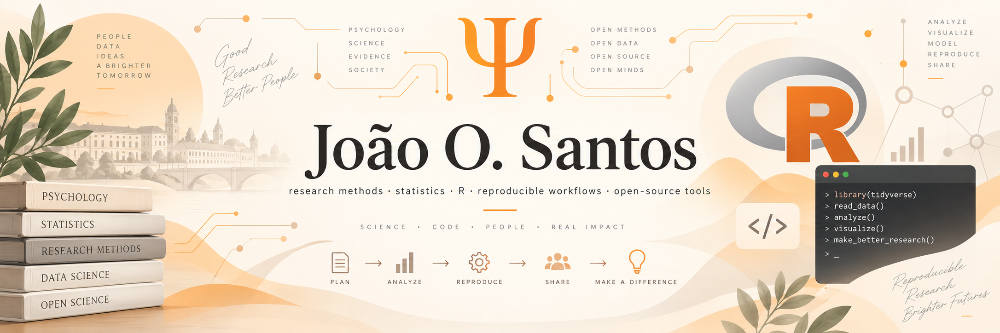

  

  
  
  
  
  

## Hi, I'm João (John)

I'm an **Assistant Professor at ISPA**. A lot of what I do sits where **philosophy of science, research methods, and statistics** meet: I teach across those areas, do quantitative consulting, and build tools for research and teaching. My academic background is in social psychology, with research on how adults perceive and treat children as a social category.

This GitHub profile is mostly the technical side of that work: **R, reproducible research, Linux, research software, and small open-source tools**. More recently, it also includes some experiments around LLM-assisted workflows.

I have a strong preference for software that is easy to inspect, easy to modify, and not much cleverer than it needs to be. If a small tool starts to look like a control room, I become suspicious.

A lot of my older work lives on [GitLab](https://gitlab.com/joao-o-santos), which is still the canonical home for several projects. I mirror more of it here now because GitHub makes the work easier to find and contribute to.

## A few things I maintain

| Project | What it is |
| --- | --- |
| **[Pi Sych](https://github.com/Joao-O-Santos/pi-sych)** | A small package around Pi for longer LLM-assisted projects, with project state kept in ordinary files and bounded work handed to fresh contexts. [Docs](https://joao-o-santos.gitlab.io/pi-sych/) · [GitLab](https://gitlab.com/joao-o-santos/pi-sych) |
| **[J's Pi Bakery](https://github.com/Joao-O-Santos/j-pi-bakery)** | The home for my small Pi extensions and companion tools, including [pi-pew-pew](https://github.com/Joao-O-Santos/pi-pew-pew), [pi-filler](https://github.com/Joao-O-Santos/pi-filler), [pi-lease](https://github.com/Joao-O-Santos/pi-lease), [pi-auch](https://github.com/Joao-O-Santos/pi-auch), and [pi-tin](https://github.com/Joao-O-Santos/pi-tin). |
| **[tr.iatgen](https://github.com/iatgen/tr.iatgen)** | An R package I co-developed with Michal Kouril for adapting `iatgen`-generated Qualtrics QSF files for non-English samples. [Paper](https://doi.org/10.1371/journal.pone.0342742) |
| **[NRB](https://rggd.gitlab.io/nrb/)** | An open collection of European Portuguese teaching materials on research methods, statistics, R, and scientific writing. |
| **[make-it-stop](https://github.com/Joao-O-Santos/make-it-stop)** | A deliberately small static-site generator. Several of my own sites use it. The name is also a design requirement. [GitLab](https://gitlab.com/joao-o-santos/make-it-stop) |

## What tends to show up here

- **Research and data:** R, statistical modelling, mixed and multilevel models, robust methods, visualisation, experimental and survey methods.
- **Reproducible work:** Quarto, R Markdown, Pandoc, LaTeX, Git, CI/CD, and analysis/reporting workflows that can be inspected as a whole.
- **Software and systems:** Linux, shell, TypeScript/Node.js, Make, research software, and small utilities built because I wanted something simpler—or wanted to understand how it worked.
- **LLM-assisted work:** experiments in making model-assisted projects easier to inspect, control, reproduce, and hand back to a human.

## Research, teaching, and consulting

The code is only part of what I do. My academic work, publications, teaching, and supervision are in my [CV](https://joao-o-santos.gitlab.io/cv/), and I keep a broader selection of research, teaching, and software work on my [Projects/Work](https://joao-o-santos.gitlab.io/portfolio.html) page.

I also do [independent consulting](https://joao-o-santos.gitlab.io/services.html) on research methods, statistics, and data analysis, especially when the hard part is deciding what analysis actually makes sense or turning a messy research problem into a reproducible workflow.

## Elsewhere

- **[Website](https://joao-o-santos.gitlab.io/)** — the short version of who I am and what I do
- **[CV](https://joao-o-santos.gitlab.io/cv/)** — publications, teaching, academic work, and the formal record
- **[Projects](https://joao-o-santos.gitlab.io/portfolio.html)** — research, teaching, software, and assorted experiments
- **[Blog](https://joao-o-santos.gitlab.io/blog/)** — notes on research, statistics, computers, AI, and things I probably could have kept to myself
- **[Services](https://joao-o-santos.gitlab.io/services.html)** — consulting, tutoring, and workshops
- **[GitLab](https://gitlab.com/joao-o-santos)** — canonical source for several projects

---

Most projects are small on purpose. A few are small because that is as far as I got.

