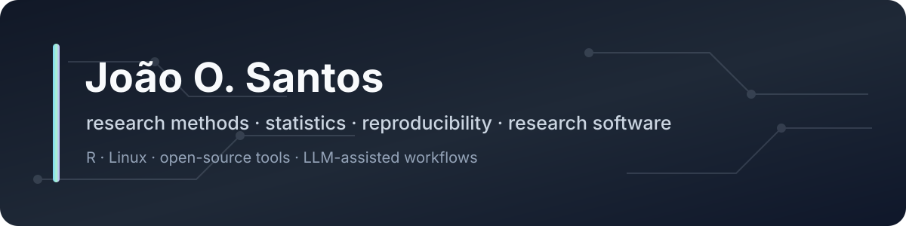

  

  
  
  
  
  

## Hi, I'm João (John)

I'm an **Assistant Professor at ISPA** with a PhD in social psychology. During my PhD I worked on how adults perceive children as a social category, and along the way I became increasingly fascinated by how we connect **philosophy of science with research methods, statistics, and data analysis**. That interest has carried forward into much of my research, teaching, and consulting work.

GitHub shows the more technical side of what I do. I work with **R, reproducible research, Linux, research software, and small open-source tools**, and I have recently been experimenting quite a bit with **LLM-assisted workflows**. I tend to like tools that are small enough to inspect, understand, modify, and stop when they are no longer useful.

A lot of my work historically lives on [GitLab](https://gitlab.com/joao-o-santos), which is still the canonical home for several projects. I increasingly mirror relevant public work here too, because GitHub makes it easier for more people to find, inspect, and contribute to it.

## Selected projects

| Project | What it is |
| --- | --- |
| **[Pi Sych](https://github.com/Joao-O-Santos/pi-sych)** | A small package around Pi for longer LLM-assisted projects. It keeps important state in ordinary files, uses fresh contexts for bounded work, and keeps final decisions with the user. [Docs](https://joao-o-santos.gitlab.io/pi-sych/) · [GitLab](https://gitlab.com/joao-o-santos/pi-sych) |
| **[J's Pi Bakery](https://github.com/Joao-O-Santos/j-pi-bakery)** | A home for my small Pi extensions and companion tools. [GitLab](https://gitlab.com/joao-o-santos/j-pi-bakery) |
| **[pi-pew-pew](https://github.com/Joao-O-Santos/pi-pew-pew)** | Small, read-only web access for Pi, including JavaScript rendering and screenshots when seeing the page matters. [GitLab](https://gitlab.com/joao-o-santos/pi-pew-pew) |
| **[pi-lease](https://github.com/Joao-O-Santos/pi-lease)** | Starts a separate visible Chromium session when Pi genuinely needs browser interaction, while leaving normal sessions alone. [GitLab](https://gitlab.com/joao-o-santos/pi-lease) |
| **[pi-auch](https://github.com/Joao-O-Santos/pi-auch)** | Quota visibility for OpenAI Codex and GitHub Copilot inside Pi. [GitLab](https://gitlab.com/joao-o-santos/pi-auch) |
| **[tr.iatgen](https://github.com/iatgen/tr.iatgen)** | An R package I co-developed with Michal Kouril for adapting `iatgen`-generated Qualtrics QSF files for non-English samples. [Paper](https://doi.org/10.1371/journal.pone.0342742) |
| **[NRB](https://rggd.gitlab.io/nrb/)** | An open collection of European Portuguese teaching materials on research methods, statistics, R, and scientific writing. |
| **[make-it-stop](https://github.com/Joao-O-Santos/make-it-stop)** | A deliberately small static-site generator. Several of my own sites are built with it. [GitLab](https://gitlab.com/joao-o-santos/make-it-stop) |

## The kinds of things I work on

**Research and data**  
R, statistical modelling, mixed and multilevel models, robust methods, data visualisation, experimental and survey methods.

**Reproducible work**  
Quarto, R Markdown, Pandoc, LaTeX, Git, CI/CD, and workflows where the analysis and the report can be inspected together.

**Software and systems**  
Linux, shell, TypeScript/Node.js, Make, small utilities, research software, and the occasional tool built mostly because I wanted to understand the whole thing.

**LLM-assisted work**  
Small tools and experiments for making model-assisted projects easier to inspect, control, reproduce, and hand back to a human.

## Research, teaching, and consulting

The technical work is only one side of what I do. The broader thread is still the same one that interests me in teaching and research: **how do we connect the question we are asking, what counts as evidence, the design of the study, and the analysis we eventually run?**

I teach statistics, research methods, philosophy of science, and R. I also do independent quantitative consulting, particularly when the difficult part is figuring out what analysis actually makes sense, turning a messy research problem into something tractable, or building a reproducible analysis and reporting workflow.

  

## Elsewhere

- **[Website](https://joao-o-santos.gitlab.io/)** for the short version of who I am and what I do
- **[CV](https://joao-o-santos.gitlab.io/cv/)** for publications, teaching, academic work, and the formal record
- **[Projects](https://joao-o-santos.gitlab.io/portfolio.html)** for research, teaching, and software projects beyond what is mirrored here
- **[Blog](https://joao-o-santos.gitlab.io/blog/)** for notes on research, statistics, computers, AI, and whatever else I probably should have kept to myself
- **[Services](https://joao-o-santos.gitlab.io/services.html)** for consulting, tutoring, and workshops
- **[GitLab](https://gitlab.com/joao-o-santos)** for the canonical source of several projects

---

Most projects are small on purpose.

